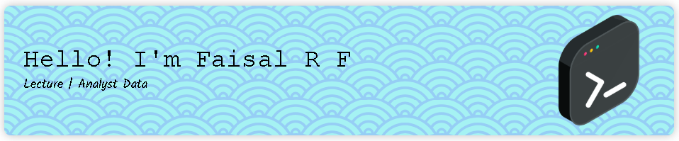

## Hey 👋 What's Up?

<!--
**DausssWeb/DausssWeb** is a ✨ _special_ ✨ repository because its `README.md` (this file) appears on your GitHub profile.

Here are some ideas to get you started:

- 🔭 I’m currently working on ...
- 🌱 I’m currently learning ...
- 👯 I’m looking to collaborate on ...
- 🤔 I’m looking for help with ...
- 💬 Ask me about ...
- 📫 How to reach me: ...
- 😄 Pronouns: ...
- ⚡ Fun fact: ...
-->
<!-- 
- 🔭 Currently I am studying at **STMIK MARDIRA INDONESIA**🧑‍💻  
- 🌱 I’m currently learning [**Laravel**](https://laravel.com) Framework  

##### Skills

  
  

##### Connect with Me
  

##### Github Stats
 -->

# 💫 About Me:
🔭 Currently I am studying at **STMIK MARDIRA INDONESIA**🧑‍💻   🌱 I’m currently learning [**Laravel**](https://laravel.com) Framework 

## 🌐 Socials:
   

# 💻 Tech Stack:
                    
# 📊 GitHub Stats:
 
 

## 🏆 GitHub Trophies

## ✍️ Random Dev Quote

<!-- Proudly created with GPRM ( https://gprm.itsvg.in ) -->
## 🕹️Play Game with Me

###

###

<picture>
  <source media="(prefers-color-scheme: dark)" srcset="https://raw.githubusercontent.com/DausssWeb/DausssWeb/output/pacman-contribution-graph-dark.svg">
  <source media="(prefers-color-scheme: light)" srcset="https://raw.githubusercontent.com/DausssWeb/DausssWeb/output/pacman-contribution-graph.svg">
  
</picture>

###